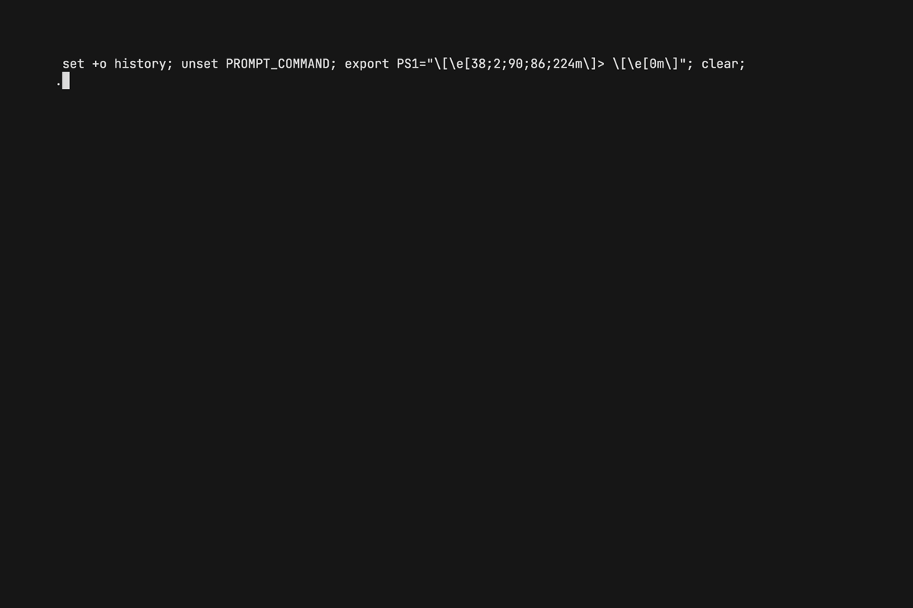

# formula1-go

`f1go` is a command line application to show and display Formula1 schedules, standings, and results.



## Features

- WCC standings
- WDC standings
- Season schedule
- Race results
- Qualifying results

## Install

### Binary

Binaries are available for MacOS, Windows, and Linux for both amd64 and arm64 architectures.
You can download them from the [release tab](https://github.com/acifani/formula1-go/releases/latest).

If you want to be able to run the `f1go` command from anywhere, you will need to either
add the binary directory to your `PATH` or move the binary in a location that is already configured.

### Go

```shell
$ go install github.com/acifani/formula1-go/cmd/f1go
```

## Usage

**formula1-go** can be launched by running the `f1go` command in your terminal.

By default, it will show the latest race results. You can then navigate the application:

- `s` - Season schedule
- `d` - WDC standings
- `c` - WCC standings

When viewing the season schedule or a specific race, you can type `q` to view the qualifying results.
